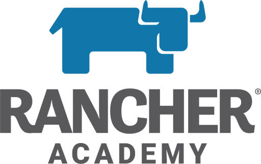

Good afternoon and happy Friday! Thanks to the wonderful [Network Chuck](https://youtu.be/gwUz3E9AW0w), today is day one of this website. As a beginning post I thought I would start with a free DevOps certification.

<!--truncate-->

:::tip

As a quick update, I have successfully passed the Rancher Operator: Level One!

As I previously mentioned, despite the fact that this is a Rancher certificate that is obviously geared towards the Rancher product, I highly recommend this certification for anyone that is new to the *Kubernetes* world or needs a refresher for the matter.

Rancher Operator: Level One touches upon many of the core concepts of *Kubernetes* and is a great place to start.

:::

Rancher is one of the leading companies when it comes to all things DevOps (they haven’t paid me to say that). As a commitment to the community, late last year *Rancher* released a no cost certification for their Rancher platform. While the certification is about Rancher’s cluster management tool, the certification is a great entry into the world of *Kubernetes*. 

[https://academy.rancher.com/](https://academy.rancher.com/)

Hopefully before my next post, I will be Rancher Operator certified! 

Have a great weekend everyone!

Cheers,

Peter