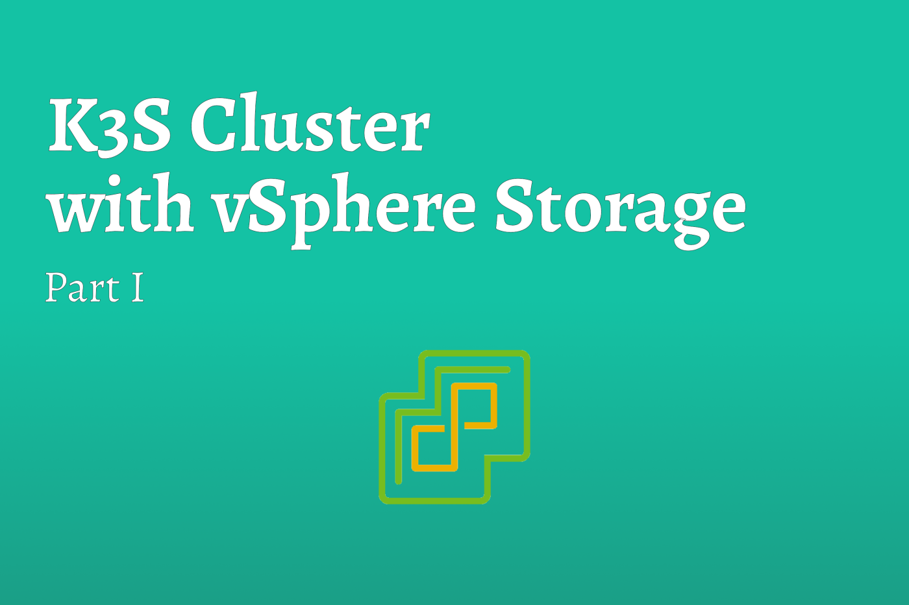

# K3S Cluster with vSphere Storage [Part I]

Whether you work in an environment that utilizes VMware products, you have a VMware Homelab or you just want to learn something different for Kubernetes Storage this post is for you.

<!--truncate-->

When deploying a highly available Kubernetes cluster, distributed storage becomes a thorn in your side. Just like every other Cloud Native tool, there are a number of solutions out there; Rancher Lab’s Longhorn and GlusterFS just to name two. However, did you know, starting with vSphere 6.7u3 and newer, you can utilize your existing vSphere Datastore as persistent storage for your Kubernetes clusters?

Being a huge fan of Rancher Labs, and K3S, this blog will describe how to deploy a K3S cluster on vSphere and utilize vSphere Datastores as persistent storage.

## Why write this blog?
I’ll begin with openly admitting that i’m no William Shakespeare. I’m not the best at writing and i’m even worse at spelling (thank you spell check) but I have a way with simplifying a tough technical subject so that I can, and even management can, understand the task.

So, I decided to write this blog post for two main reason; firstly, and most selfishly, I wrote it for me. I guarantee there is going to be a time in my future where I’m going to need to understand how I accomplished this task. While writing documentation is a pain, it does provide very useful from time to time and as an added bonus, by writing down the steps and researching the technology behind it, I gained additional knowledge and have a better chance at remembering it too. If it just so happens that the post helps you too, well then thats another great bonus.

The second reason I wrote this blog is because I really didn’t find much out there talking about the same topic. Anytime I’ve research Kubernetes Storage, it resulted in deploy X or install Y. In the same fashion, anytime you research anything Kubernetes related it will involve something cloud related i.e. use AWS S3 buckets. While I’ll believe AWS has a time and a place, I like to do things on-prem and in Homelabs too.

## How does this all work?
Before we get into the fun stuff, I thought I would explain what is going to happen and how it allows us to utilize vSphere resources. Feel free to skip this if you want as this is more of an FYI if you ever need to deploy this in a secured production environment and have to explain yourself.

Traditionally Kubernetes (K8s) deploys with “In-Tree” cloud providers. The simplest way i’ve understood this is; providers are essentially drivers within Kubernetes that allow communication with cloud resources; for example AWS ELBs. They can essentially translate Kubernetes commands into the appropriate cloud API calls. Using the AWS ELB example, it could, in theory, update the ELB to include a new host IP.

With K3S, Rancher Labs manages to minimize the binary by removing these providers and including a lightweight “local” cloud provider. K3S can be deployed in small environments, on IOT devices, on the Edge and even in space. In these situations, Cloud providers aren’t needed. Just imagine the bill trying to reach AWS services from space. With all that being said, K3S can still be deployed in a production environment and can still utilize other cloud providers.

When adding additional Cloud Providers to any Kubernetes distribution, it is known as “Out-of-Tree” Cloud Providers. vSphere provides both the Cloud Provider Interface (CPI) and Container Storage Interface (CSI) for install in this method.

:::tip
Traditionally Kubernetes recommended using In-Tree providers. However, recently there has been a shift to using Out-of-Tree providers by default.
:::

## Terminology

| **Term** | **Definition** |
| :---: | --- |
| Cloud Provider Interface (CPI) | The Brains of the Provider. This is what makes the connection between the Kubernetes Cluster and the Cloud Provider |
| Container Storage Interface (CSI) | Using the CPI, this allows Kubernetes Storage Classes the ability to communicate with and utilize cloud tools. For example, vSphere Datastore |
| In-Tree Providers | Providers natively shipped with Kubernetes |
| Out-of-Tree Providers | Providers that are installed into Kubernetes after deployment |

## Summary
While this blog was filled with dry information, it definitely helps describe what the heck is going on. In the next part of this blog, I will demonstrate the deployment of a K3S cluster in a vSphere environment.

## References

* [Rancher Labs Longhorn](https://longhorn.io/)
* [vSphere Cloud Provider](https://cloud-provider-vsphere.sigs.k8s.io/)
* [Rancher Labs K3S](https://rancher.com/docs/k3s/latest/en/)
* [Kuberenetes Cloud Controllers](https://kubernetes.io/docs/concepts/architecture/cloud-controller/        )