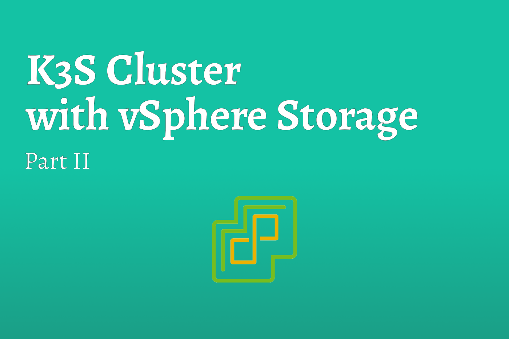

# K3S Cluster with vSphere Storage [Part II]


Continuing on the discussion from [Part I](../2021-07-30-k3s-vsphere-part1/index.md), in this part we are going to deploy a K3S cluster on a vSphere environment.

<!--truncate-->

## Step 1: The Setup

:::note
I’m currently in the process of creating Terraform scripts to accomplish this deployment, but feel free to deploy you cluster per your favorite method. I will create a blog post describing my Terraform scripts and the headache that PhotonOS caused once I’ve completed the Terraform Script.
:::

The first thing we need to do is setup some nodes to deploy our K3S cluster too. Because I like pain, I decided to do this with VMware’s PhotonOS but you can use something much simpler like Ubuntu. 

For this blog, I’m deploying; 3x VMs to act as Server (Master) nodes, 3x VMs to act as Agents (Worker) nodes and 1x VM as a cluster load balancer. At a minimum, each Virtual Machine (VM) needs to have a static IP, be able to communicate to one another and be able to communicate to the vSphere server (IP or FQDN). For complete setup instructions, refer to Rancher’s K3S documentation to find out what requirements your distribution of Linux needs to deploy K3S.

The hardware requirements for each node is going to be specific to what you wish to deploy within the cluster. Because workloads vary dramatically, it is very difficult to suggest hardware sizes. However, as a starting point, and assuming you have the hardware capacity, I typically start with 2 vCPUs, 4GB of RAM and 16GB HDD (Thin Provisioned) and grow from there.

:::caution
If you are using PhotonOS like I did, you will need to install AppArmor with the following command:

`tdnf install -y apparmor-utils`
:::

Once you have deployed your Virtual Machines you should something similar to this. These IP addresses can be whatever suits your network as long as they can communicate to each other.

| **Node Name** | **IP Address** | **Description**
| :---: | :---: | :---: |
| MASTER-001 | 10.0.15.201 | Server (Master) Node |
| MASTER-002 | 10.0.15.202 | Server (Master) Node |
| MASTER-003 | 10.0.15.203 | Server (Master) Node |
| WORKER-001 | 10.0.15.204 | Agent (Worker) Node |
| WORKER-002 | 10.0.15.205 | Agent (Worker) Node |
| WORKER-003 | 10.0.15.206 | Agent (Worker) Node |
| LB-001 | 10.0.15.200 | NGINX Load Balancer |

## Step 2: Deploying the External Load Balancer
To make life a whole lot easier, and to follow good practices, we are going to deploy an external load balancer for the cluster. In a production environment this can be a physical appliance such as an F5, but in this example we are going to deploy NGINX. This Load Balancer is going to be configured to direct all Kubernetes Management traffic to the Server (Master) Nodes, and all the HTTP/HTTPS traffic to the Agent (Worker) Nodes.

:::tip
In a Homelab, or resource limited, environment, instead of deploying an external loadbalancer, you can deploy [MetalLB](https://metallb.universe.tf) within you cluster.
:::

In the future, after the cluster and application(s) have been deployed, DNS records will be pointed to the IP address of this Load Balancer. That traffic will be router to the cluster where an Ingress Controller will route the traffic to the appropriate services and pods.

Deploying the Load Balancer may vary depending upon your distribution of choice, but to keep this simple, all we are going to do is; install Docker on the node and deploy NGINX via Docker Compose. The following steps need to be performed on the Load Balancer node.

For PhotonOS, Docker is pre-installed. To utilize Docker on PhotonOS, you need to enable and start the Docker service.

``` bash
## ENABLE DOCKER SERVICE
systemctl enable docker.service

## START DOCKER SERVICE
systemctl start docker.service
```

:::caution
As of 30 July 2021, PhotonOS 4.0 (build 1526e30ba) ships with an older version of Docker (Docker version 19.03.15, build 99e3ed8). Because of this we will need to install Docker-Compose.

``` bash
## INSTALL DOCKER-COMPOSE BINARY
curl -L "https://github.com/docker/compose/releases/download/1.29.2/docker-compose-$(uname -s)-$(uname -m)" -o /usr/local/bin/docker-compose

## MAKE EXECUTABLE
chmod +x /usr/local/bin/docker-compose
```
:::

Now that we have our dependencies taken care of, the last thing we need to do is create some configurations files. The first one is `docker-compose.yml` and it is simply deploying a NGINX image with the configuration file that we are about to write. Additionally, the configuration specifies that NGINX shall use the local configuration file (`nginx.conf`) and to expect traffic on ports; 80, 443, 6443.

:::tip
Do NOT use “latest” tags in production. This is bad practice and can lead to unexpected outages and issues. By default, not specifying a tag, latest will be used. 
:::

Given this is in a Homelab, we can ignore this best practice.

``` yaml title="docker-compose.yml"
## DEFINE VERSION
version: "3.7"

## DEFINE SERVICE
services:
  nginx:
    image: nginx
    restart: always
    volumes:
      - ./nginx.conf:/etc/nginx/nginx.conf
    ports:
      - 80:80
      - 443:443
      - 6443:6443
```

Before we can start our NGINX image, we have to create the NGINX configuration. The file below is a simple configuration file that routes all HTTP/HTTPS traffic to the Agent (Worker) nodes and all Kubernetes Management traffic the Server (Master) nodes.

Update the IP addresses to reflect the addresses you have specified in your environment.

``` title="nginx.conf"
worker_processes 4;
worker_rlimit_nofile 40000;

events {
    worker_connections 8192;
}

stream {
    upstream servers_http {
        least_conn;
        server 10.0.15.204:80 max_fails=3 fail_timeout=5s;
        server 10.0.15.205:80 max_fails=3 fail_timeout=5s;
        server 10.0.15.206:80 max_fails=3 fail_timeout=5s;
    }
    server {
        listen 80;
        proxy_pass servers_http;
    }

    upstream servers_https {
        least_conn;
        server 10.0.15.204:443 max_fails=3 fail_timeout=5s;
        server 10.0.15.205:443 max_fails=3 fail_timeout=5s;
        server 10.0.15.206:443 max_fails=3 fail_timeout=5s;
    }
    server {
        listen     443;
        proxy_pass servers_https;
    }

    upstream api_server {
      server 10.0.15.201:6443;
      server 10.0.15.202:6443;
      server 10.0.15.203:6443;
    }

    server {
      listen 6443;
      proxy_pass api_server;
      proxy_timeout 30;
      proxy_connect_timeout 2s;
    }
}
```

Now we have both of our configuration files, the last thing to do is start the NGINX instance. To do this we run `docker-compose up -d`. This will start the NGINX instance in a detached state.

## Step 3: Deploying the Cluster
Now that we have our external Load Balancer in place, we can turn our attentions to the cluster.

### Configure Primary Server (Master) Node
The first step in creating a cluster is deploying our primary Server (Master) node and initiating the Kubernetes cluster.

1. SSH into the primary Server (Master) Node
2. Create a `k3s-config.yaml` file

``` yaml title="k3s-config.yaml"
cluster-init: true
disable-cloud-controller: true
write-kubeconfig-mode: "0644"
tls-san:
  - "10.0.15.200"
disable:
  - traefik
kubelet-arg:
  - "cloud-provider=external"
```

3. Install the Primary Master Node

``` bash
curl -sfL https://get.k3s.io | sh -s - server --disable-cloud-controller --config /root/k3s-config.yaml
```

4. Obtain the Cluster token for use in future steps

``` bash
cat /var/lib/rancher/k3s/server/node-token
```

### Configure additional Server (Master) Nodes
For each of the remaining Server (Master) Nodes, follow the following steps;

1. SSH into the Node
2. Save the Server Token as an environment variable.
``` bash
export K3S_TOKEN='{{ CLUSTER_TOKEN }}'
```
3. Install K3S as a Server
``` bash
curl -sfL https://get.k3s.io | INSTALL_K3S_EXEC="--no-deploy traefik" sh -s - server --disable-cloud-controller --server https://10.0.15.200:6443 --token $K3S_TOKEN
```

### Configure Agents (Worker) Nodes
Finally, lets add the Agent (Worker) Nodes to the cluster.

1. SSH into the Node
2. Save the Cluster Token as an environment variable
``` bash
export K3S_TOKEN='<<CLUSTER_TOKEN>>'
```
3. Install K3S as a Agent
``` bash
curl -sfL https://get.k3s.io | sh -s - agent --server https://10.0.15.200:6443 --token $K3S_TOKEN
```

## Step 4: Configure Local Workstation
To make management easier, we can configure your local workstation to manage the cluster. This removes the need to SSH into different machines.

### Prerequisites
To enable your local workstation the ability to manage the cluster, please ensure the workstation has `kubectl` installed. On a Mac, you can use `brew install kubectl`. For other operating systems you can follow the Kubernetes documentation; For [Windows](https://kubernetes.io/docs/tasks/tools/install-kubectl-windows/), and for [Linux](https://kubernetes.io/docs/tasks/tools/install-kubectl-linux/).

### Configuration Steps

1. Copy kubeconfig file from Primary Server (Master) Node onto your local workstation (Replace the IP address with the IP of your primary Server (Master) Node.)
``` bash
scp root@10.0.15.201:/etc/rancher/k3s/k3s.yaml k3s.yaml
```
2. By default, the generated `KUBECONFIG` file (`k3s.yaml`) is populated with `127.0.0.1:6443` as the server address. You will need to update this file to reflect your external load balancer IP Address.
3. Finally, configure your Terminal to utilize the new kubeconfig. 
``` bash
export KUBECONFIG=~/k3s.yaml
```

## Summary
Having followed this blog post, you should now have the framework of the cluster up and running. Before we can start deploying workloads there are a few more steps that we need accomplish.

## References

* [Rancher Labs Longhorn](https://longhorn.io/)
* [vSphere Cloud Provider](https://cloud-provider-vsphere.sigs.k8s.io/)
* [Rancher Labs K3S](https://rancher.com/docs/k3s/latest/en/)
* [Kuberenetes Cloud Controllers](https://kubernetes.io/docs/concepts/architecture/cloud-controller/)
* [VMware Photon OS](https://vmware.github.io/photon/docs/)
* [NGINX Load Balancer](http://nginx.org/en/docs/http/load_balancing.html)