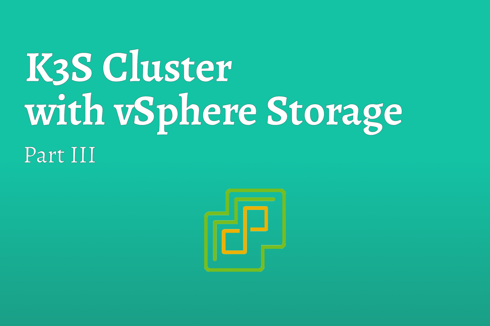

# K3S Cluster with vSphere Storage [Part III]


Having followed the steps in Part II, you should have a K3S Cluster stood up. In this Part we are going to add the all important Cloud Provider.

<!--truncate-->

## Step 1: Prepare Nodes for vSphere Cloud Provider
Before we can install the vSphere Cloud provider, there are couple configurations that need to be applied. You can read more about these requirements by heading over to the [VMWare documentation](https://cloud-provider-vsphere.sigs.k8s.io/).

### Taint Nodes
The Cloud Provider is going to be installed on the Server (Master) Nodes. To ensure this happens correctly, we need to ensure the nodes are tainted correctly.

:::caution
Not sure if this is a K3S quirk or just my luck, but additionally I had to reapply the Master and Worker roles to the Nodes for the DaemonSet to recognize the Role.
:::

``` bash
## TAINT SERVER (MASTER) NODES
kubectl taint nodes --selector='node-role.kubernetes.io/master' node-role.kubernetes.io/master=:NoSchedule

## ADD ROLES TO SERVER (MASTER) NODES
kubectl label nodes --selector='node-role.kubernetes.io/master' node-role.kubernetes.io/master= --overwrite

## TAINT AGENT (WORKER) NODES
kubectl taint nodes --selector='!node-role.kubernetes.io/master' node.cloudprovider.kubernetes.io/uninitialized=true:NoSchedule

## ADD ROLES TO AGENT (WORKER) NODES
kubectl label nodes --selector='node-role.kubernetes.io/worker' node-role.kubernetes.io/worker= --overwrite
```

Once you have applied the Taints, you can verify they applied successfully by running this command;

``` bash
## VALIDATE TAINTS
kubectl describe nodes | egrep "Taints:|Name:"
```

If the taints applied successfully you should see all the Server (Master) Nodes with the Taint `node-role.kubernetes.io/master:NoSchedule` and all Agent (Worker) Nodes have the Taint `node.cloudprovider.kubernetes.io/uninitialized=true:NoSchedule`

### Configure Virtual Machine Settings
Another configuration item that needs to occur, is ensuring that each virtual machine’s hard disk (vmdk) is assigned a unique identifier (UUID). The easiest way to interact with the virtual machine settings is to use a command line utility called `govc`.

> govc is vSphere CLI provided by VMware and is built on top of govmoi. The CLI is designed to be a user friendly CLI alternative to the GUI and well suited for automation tasks. It also acts as a test harness for the govmomi APIs and provides working examples of how to use the APIs.
> 
> – [*Govc Github*](https://github.com/vmware/govmomi/tree/master/govc)

To install the CLI on Mac, you can use Homebrew. To install govc run `brew install govc`. For other operating systems, please refer to the [documentation](https://github.com/vmware/govmomi/tree/master/govc).

### GOVC Setup
Before we can use the utility we have to specify how `govc` connects to vSphere. In Mac and Linux, this is accomplished by setting environment variables.

``` bash
## CONFIGURE GOVC
export GOVC_URL='{{ URL-FOR-VCSA }}'
export GOVC_USERNAME='administrator@vsphere.local'
export GOVC_PASSWORD='{{ PASSWORD-FOR-ABOVE-ACCOUNT }}'
export GOVC_INSECURE=1
```

| **Variable** | **Description** |
| --- | --- |
| GOVC_URL | the URL for your vSphere (VCSA) instance |
| GOVC_USERNAME | the login account for vSphere |
| GOVC_PASSWORD | the password for the account specified |
| GOVC_INSECURE | used when self-signed certificates are in use on VCSA, suppresses certificate warnings |

### Enable DiskUUID
At this point you should be able to utilize `govc` to query vSphere. The first command you can run is `govc ls`. This will list the any DataCenters you have configured and folders. You will need to enable DiskUUID on all the virtual machines in the cluster and to do this you will need to know the path to the virtual machine.

To find the path use the `govc ls` command followed by a path. Start with leaving it blank and keep drilling down until you find the paths to your virtual machines. For the example below, my final govc command looked like; `govc ls /Homelab/vm/Applications/Demo/`

Enable DiskUUID on the virtual machines by running the following command. Outline below is how I applied it in my stack.

``` bash
## ADD DISK UUID FLAG
govc vm.change -e="disk.enableUUID=1" -vm='{{ PATH-TO-VM }}'

## EXAMPLE -- ADD DISK UUID 
govc vm.change -e="disk.enableUUID=1" -vm='/Homelab/vm/Applications/Demo/MASTER-001'
govc vm.change -e="disk.enableUUID=1" -vm='/Homelab/vm/Applications/Demo/MASTER-002'
govc vm.change -e="disk.enableUUID=1" -vm='/Homelab/vm/Applications/Demo/MASTER-003'
govc vm.change -e="disk.enableUUID=1" -vm='/Homelab/vm/Applications/Demo/WORKER-001'
govc vm.change -e="disk.enableUUID=1" -vm='/Homelab/vm/Applications/Demo/WORKER-002'
govc vm.change -e="disk.enableUUID=1" -vm='/Homelab/vm/Applications/Demo/WORKER-003'
```

### Adding ProviderID

The final configuration change needed is to add a “ProviderID” to each of the nodes. Reading though the documentation, this ID needs to be unique but can be set to anything (within reason). Borrowing from the documentation, the easiest thing to do is to assign the virtual machine UUID as the ProviderID as these are always unique.

``` bash
## ADD PROVIDERID TO EACH NODE
for vm in $(govc ls /Homelab/vm/Applications/Demo/); do
MACHINE_INFO=$(govc vm.info -json -dc=Homelab -vm.ipath="$vm" -e=true)
VM_NAME=$(jq -r ' .VirtualMachines[] | .Name' <<< $MACHINE_INFO | awk '{print tolower($0)}')
VM_UUID=$( jq -r ' .VirtualMachines[] | .Config.Uuid' <<< $MACHINE_INFO | awk '{print toupper($0)}')
kubectl patch node $VM_NAME.dodbrit.lab -p "{\"spec\":{\"providerID\":\"vsphere://$VM_UUID\"}}";
done
```

For good measure, you can validate that the ProviderIDs were added correctly by running `kubectl describe nodes | egrep "ProviderID:|Name:"`. The expected outcome should be all of the nodes listed, with a ProviderID that starts with “vsphere”. Additionally, the IDs should all be unique.

## Step 2: Install vSphere CPI
Now that we have our cluster up and running, and the nodes configured with additional information, we can finally install the vSphere Cloud Provider.

The first step is generate the required configuration file (`vsphere.conf`) and credentials (`cpi-secret.yaml`).

``` conf title="vsphere.conf"
# vsphere.conf

# Global properties in this section will be used for all specified vCenters unless overriden in VirtualCenter section.
global:
  # default https port
  port: 443
  # set insecureFlag to true if the vCenter uses a self-signed cert
  insecureFlag: true
  # settings for using k8s secret
  secretName: cpi-global-secret
  secretNamespace: kube-system

# vcenter section
vcenter:
  # arbitrary name for cluster
  demo:
    # ip or fqdn of vcsa
    server: 10.0.15.5
    # vSphere Datacenter Name
    datacenters:
      - Homelab
    # secret with credentials
    secretName: cpi-secret
    secretNamespace: kube-system
```

``` yaml title="cpi-secret.yaml"
# cpi-secret.yaml

apiVersion: v1
kind: Secret
metadata:
  name: cpi-secret
  namespace: kube-system
stringData:
  10.0.15.5.username: "administrator@vsphere.local"
  10.0.15.5.password: "{{ PASSWORD-TO-ACCOUNT }}"
```

To apply the vSphere configuration to the cluster, we will create a ConfigMap of the file. To do that you run the following command;

``` bash
kubectl create configmap cloud-config --from-file=vsphere.conf --namespace=kube-system
```

This will create a ConfigMap in the `kube-system` namespace with all the items we defined. To add the login credentials, we just need to apply the Secret as that was defined as a Secret to begin with.

``` bash
kubectl create -f cpi-secret.yaml
```

Again for peace of mind, we can validate these applied;

``` bash
## ENSURE CONFIGMAP WAS CREATED
kubectl get configmap cloud-config --namespace=kube-system

## ENSURE SECRET WAS CREATED
kubectl get secret cpi-secret --namespace=kube-system
```

After you have verified that the ConfigMap and Secret was created, you can delete both of these files. These files have potentially sensitive information in them and its good practice to remove them.

Now we can deploy all the components of the vSphere Cloud Provider. We are going to apply them directly from the vSphere GitHub repository.

:::tip
It is recommend that you review the files first and once you feel confident that the files are safe, you can then apply them
:::

``` bash
## CREATE ROLES
kubectl apply -f https://raw.githubusercontent.com/kubernetes/cloud-provider-vsphere/master/manifests/controller-manager/cloud-controller-manager-roles.yaml

## CREATE ROLE BINDINGS
kubectl apply -f https://raw.githubusercontent.com/kubernetes/cloud-provider-vsphere/master/manifests/controller-manager/cloud-controller-manager-role-bindings.yaml

## CREATE DAMEONSET
kubectl apply -f https://github.com/kubernetes/cloud-provider-vsphere/raw/master/manifests/controller-manager/vsphere-cloud-controller-manager-ds.yaml
```

And we can check that the Cloud Provider deployed successfully. You should see a **vsphere-cloud-controller-manager** running on each of your master nodes.

``` bash
kubectl get pods --all-namespaces
```

Congratulations! We have just install the vSphere Cloud Provider within our cluster!

## Step 3: Install vSphere CSI

Now that the Cloud Provider has been installed, we can turn the attention to the Cloud Storage Interface (CSI). Just like the Cloud Provider, we need to create some configuration files. Modify the file outlined below and save it as `csi-vsphere.conf`.

``` conf title="csi-vsphere.conf"
[Global]
cluster-id = "k3s-cluster"
user = "administrator@vsphere.local"
password = "{{ PASSWORD-FOR-ACCOUNT }}"
port = "443"
insecure-flag = "1"

[VirtualCenter "{{ VCSA-IP-ADDRESS }}"]
datacenters = "Homelab"

[Workspace]
server = "{{ VCSA-IP-ADDRESS }}"
datacenter = "Homelab"
default-datastore = "{{ DEFAULT-VSPHERE-DATASTORE }}"
resourcepool-path = "{{ DATACENTER-NAME }}/Resources"
folder = "kubernetes"

[Disk]
scsicontrollertype = pvscsi
```

The default-datastore field in the configuration file is important enough that it is included in the file, but will not be used once we configure the Storage Class. The Storage Class grants us the ability to define where the persistent storage will be save. Additionally, multiple Storage Class‘s can be defined that will allow for more granular storage based upon the deployment.

Unlike CPI, we are going to upload this configuration to Kubernetes via a Secret.

``` bash
kubectl create secret generic vsphere-config-secret --from-file=csi-vsphere.conf --namespace=kube-system
```

When then validate that the Secret created successfully …

``` bash
kubectl get secret vsphere-config-secret --namespace=kube-system
```

:::tip
At this point, you made delete csi-vsphere.conf as it contains sensitive information.
:::

Now we can deploy all the components of the vSphere Storage Provider. We are going to apply them directly from the vSphere GitHub repository.

``` bash
## DEFINE CLUSTER ROLES
kubectl apply -f https://raw.githubusercontent.com/kubernetes-sigs/vsphere-csi-driver/v2.2.0/manifests/v2.2.0/rbac/vsphere-csi-controller-rbac.yaml

## DEFINE ROLE BINDINGS
kubectl apply -f https://raw.githubusercontent.com/kubernetes-sigs/vsphere-csi-driver/v2.2.0/manifests/v2.2.0/rbac/vsphere-csi-node-rbac.yaml

## DEPLOY STORAGE DRIVERS (CONTROLLER)
kubectl apply -f https://raw.githubusercontent.com/kubernetes-sigs/vsphere-csi-driver/v2.2.0/manifests/v2.2.0/deploy/vsphere-csi-controller-deployment.yaml

## DEPLOY STORAGE DRIVERS (DAMEONSET)
kubectl apply -f https://raw.githubusercontent.com/kubernetes-sigs/vsphere-csi-driver/v2.2.0/manifests/v2.2.0/deploy/vsphere-csi-node-ds.yaml
```

We can then validate the installation by checking the Pod deployment. It may take a few minutes for all of the pods to get created and start running.

``` bash
kubectl get pods --namespace=kube-system
```

## Summary
At this point, and ensuring that everything went smoothly, you should have a Kubernetes cluster running with both vSphere CPI and CSI running and configured. In Part IV of this blog, we are going to define the storage class within the cluster and deploy a demo application.

## References

* [Rancher Labs Longhorn](https://longhorn.io/)
* [vSphere Cloud Provider](https://cloud-provider-vsphere.sigs.k8s.io/)
* [vSphere Storage Provider](https://vsphere-csi-driver.sigs.k8s.io/)
* [Rancher Labs K3S](https://rancher.com/docs/k3s/latest/en/)
* [Kuberenetes Cloud Controllers](https://kubernetes.io/docs/concepts/architecture/cloud-controller/)
* [VMware Photon OS](https://vmware.github.io/photon/docs/)
* [NGINX Load Balancer](http://nginx.org/en/docs/http/load_balancing.html)
* [Govc Documentation](https://github.com/vmware/govmomi/tree/master/govc)