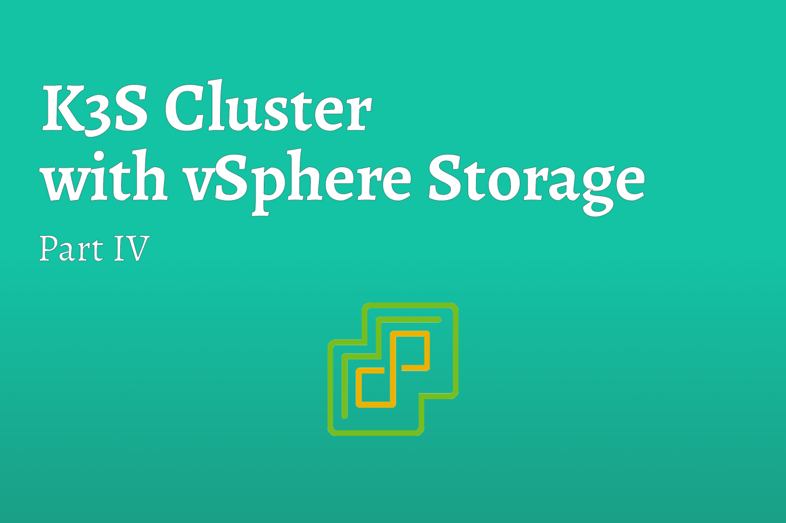
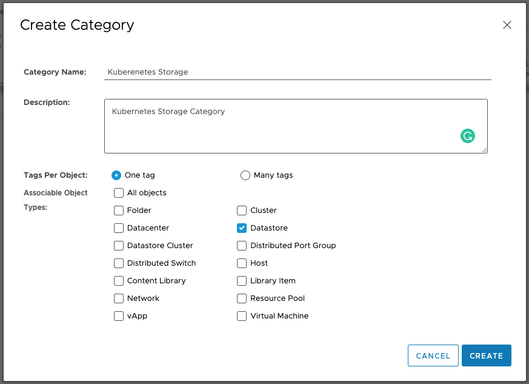
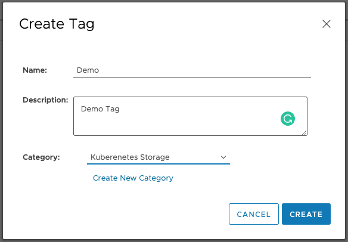
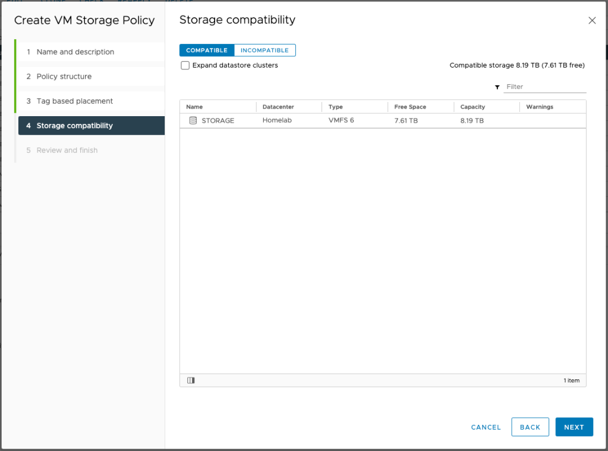

# K3S Cluster with vSphere Storage [Part IV]


Having followed along with the previous 3 blog posts, you should have a cluster that is one small step away from demonstrating the storage capabilities. In this final part of the series, we will perform our final configurations and demonstrate the simplicity of our storage solution.

<!--truncate-->

:::note
At the end of this post, your cluster isn’t quite ready for a workload as it is still missing an Ingress Controller. While deploying an Ingress Controller is outside the scope of this post, I will briefly describe how to deploy NGINX as an IngressController at the end of this post to get you started. I plan on making a post about this later to get into more detail.
:::

## Step 1: Define Storage Policy in vSphere
In order for our StorageClass to know where to store our persistent data, we are going to create a simple Storage Policy in vSphere. For the purposes of this demo, we are going to create a simple **tag based** policy. Feel free to make additional tags if your situation requires it. The names can be changed to suit your needs, but remember what you called them as you will need them later.

### vSphere Category

1. Login to your vSphere instance.
2. Click the Menu navigation dropdown and select Tags & Custom Attributes.
3. Click Categories and Select New.
4. Give the Category the name Kubernetes Storage, select One Tag, and deselect all but Datastore.
5. Click Create.



### vSphere Tags

1. Navigate back to Tags.
2. Click New and create a new tag with the Demo, using Kubernetes Storage as the Category.
3. Click Create.



### Tag vSphere Datastore
Now we need to apply our newly created tag to our Datastore. This task is as simple as navigating to the Datastore tab, clicking Summary section, and selecting Assign in the Tags card. Select the newly created Demo tag and click Assign on last time to close the dialog box.

### vSphere Storage Policy
Now that we have created our tags, and assigned them to our Datastore, we can create our simple but effective Storage Policy. Feel free to customize this later to suit your needs.

1. Click the Menu navigation dropdown and select Policy and Profiles.
2. On VM Storage Policies click Create to create a new Storage Policy.
3. Name the policy Demo and click Next (remember this name as it is needed in the StorageClass step).
4. For the Policy structure, select Enable tag based placement rules.
5. Click Next.
6. In this dialog, select the Category you created in the previous step and leave Usage Option with the defaulted Use storage tagged with.
7. Click Browse and select the appropriate Tag. Click Next.
8. Confirm that your tag rule worked by verifying the DataStore populated in this table. If they are correct click Next and then Finish.



## Step 2: Define Storage Class
The StorageClass defines how Kubernetes handles requests for persistent storage. By defining the StorageClass it allows application deployed to the cluster the ability to request storage dynamically. While this may seem a little scary at first, it’s not the wild west. Limits can still be placed on a per application or per user basis.

``` yaml title="vmware-sc.yml"
#vmware-sc.yml
kind: StorageClass
apiVersion: storage.k8s.io/v1
metadata:
  name: vsphere
  annotations:
    #storageclass.kubernetes.io/is-default-class: "true"  # Optional
provisioner: csi.vsphere.vmware.com
#allowVolumeExpansion: true  # Optional: only applicable to vSphere 7.0U1 and above
parameters:
  storagepolicyname: "Demo"  #Optional Parameter
```

In the above file;

| **Attribute** | **Description** |
| --- | --- | 
| metadata/name	Defines the name of the StorageClass. | This is the name used by your application deployments when requesting storage |
| metadata/annotations/storageclass.kubernetes.io/is-default-class | This is set to true if you wish this Storage Class to be set as the default for the cluster |
| provisioner | This tells Kubernetes to use the CSI driver we deployed in the previous blog |
| allowVolumeExpansion | This is in beta. For more information read the [documentation](https://vsphere-csi-driver.sigs.k8s.io/features/volume_expansion.html) |
| parameters/storagepolicyname | This is wait instructs the CSI to use the Storage Policy to find the correct Datastore |

We can now apply our StorageClass to the cluster and we can validated that it applied successfully;

``` bash
## APPLY STORAGE CLASS
kubectl apply -f vmware-sc.yml

## VALIDATE
kubectl get sc
```

This command should return two items; **local-path** and **vsphere**.

### Demo: Usage of vSphere Storage
Without going into a deep dive in the realm of storage, the different types, Block vs. File, I’m going to demonstrate how to use Block Storage on vSphere. For the vast majority of Kubernetes workloads Block Storage will work great.

If you have a workload that requires File Storage, review the documentation here to view the additional items that are required in vSphere to make that work.

As previously mentioned, one of the benefits of using a StorageClass is the ability to dynamically provision persistent volumes.

``` yaml title="example-storage.yml"
## example-storage.yml
apiVersion: v1
kind: PersistentVolumeClaim
metadata:
  name: vsphere-demo-labels
  labels:
    app: mongoDB
    environment: test
spec:
  accessModes:
    - ReadWriteOnce
  resources:
    requests:
      storage: 5Gi
  storageClassName: vsphere
```  

Using the example-storage.yml file defined above, running `kubectl apply -f example-storage.yml` will result in a PersistentVolumeClaim being created and a matching VMDK within vSphere.

To view your Persistent Volume Claims, simply run `kubectl get pvc`. You may need to add `-n {{ NAMESPACE_NAME }}` if you are deploying your volume in a namespace other than default.

Additionally, you can view your Persistent storage from within vSphere. If you navigate to Storage -> Name of DataStore -> Monitor. You can then select Cloud Native Storage -> Container Volumes. This will list of all the volumes being used on that Datastore.

You can add, or remove, labels in the Metadata section of the example-storage.yml file. These tags will appear within the vSphere UI and allow for easier filtering and deciphering of what application is using what volume.

The final thing to mention is, while this only an example Volume Claim, when deploying a production application, the same principles apply. Your application should have a PersistentVolumeClaim , if not multiple, and the only updates you should have to do is add the StorageClassName and possibly tags (if they aren’t already there).

## Summary

While there were quite a few steps to get your cluster configured for use with your vSphere Infrastructure, at the end of the day, the struggle should be worth it. By utilizing your vSphere infrastructure, you can leverage the same backup and restore procedures to backup your persistent data.

Thank you for taking the time to read my blog and bearing with me while I figure out this whole blogging thing. Please feel free to submit any comments below on ways to improve.

Cheers,

Peter

## References

* [Rancher Labs Longhorn](https://longhorn.io/)
* [vSphere Cloud Provider](https://cloud-provider-vsphere.sigs.k8s.io/)
* [vSphere Storage Provider](https://vsphere-csi-driver.sigs.k8s.io/)
* [Rancher Labs K3S](https://rancher.com/docs/k3s/latest/en/)
* [Kuberenetes Cloud Controllers](https://kubernetes.io/docs/concepts/architecture/cloud-controller/)
* [VMware Photon OS](https://vmware.github.io/photon/docs/)
* [NGINX Load Balancer](http://nginx.org/en/docs/http/load_balancing.html)
* [Govc Documentation](https://github.com/vmware/govmomi/tree/master/govc)