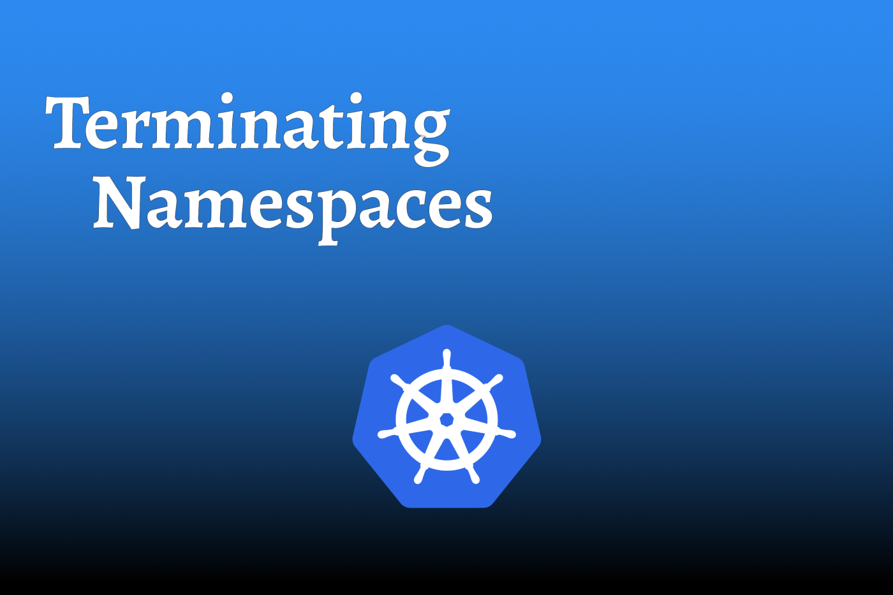

After you start playing around with *Kubernetes*, or even *Red Hat OpenShif*t, you are potentially going to run into an issue that I’ve had to encounter many times. Sometimes it happens quickly, other times it takes longer, but eventually you will run into the issue of a namespace trying to terminate but appear to be stuck.

<!--truncate-->

The TLDR of this issue, is that the **Kubernetes Finalizer** of the namespace fails to complete successfully leaving you with a namespace that is “terminating”.

:::caution

After performing extensive research on this topic, modifying the **Kubernetes Finalizer** may cause unexpected results. There have been instances where the *namespace* was removed via the **Kubernetes Finalizer** and when creating a namespace of the same name, artifacts from the previous namespace remained (i.e. Pods ). 

It is important to ensure that all artifacts (Pods, Services, etc.) have been removed prior to running this command.
 
:::

From what I have gathered (so far), the **Kubernetes Finalizer** is essentially the steps that need to be taken prior to a delete action. In this situation, it appears that the Kubernetes Finalizer is ensuring that all of the resources within a namespace have been deleted.

In a perfect world, you should track down why the Kubernetes Finalizer failed in the first place and resolve that issue. However, the world isn’t always perfect, and you don’t always have the time. 

The following command is a quick, and dirty, way to remove that terminating namespace. In most situations, it will work as expected, but there is a chance that some strange things could happen. I personally have had resources recreated after terminating a namespace and creating a new namespace with the same name as the previous namespace.

**Before running this command, be sure to replace “broken-app” with the namespace that you are trying to remove.**

``` bash showLineNumbers
export ns=broken-app; kubectl get ns "${ns}" -o json | sed s/\"kubernetes\"//g | kubectl replace --raw /api/v1/namespaces/"${ns}"/finalize -f -
```