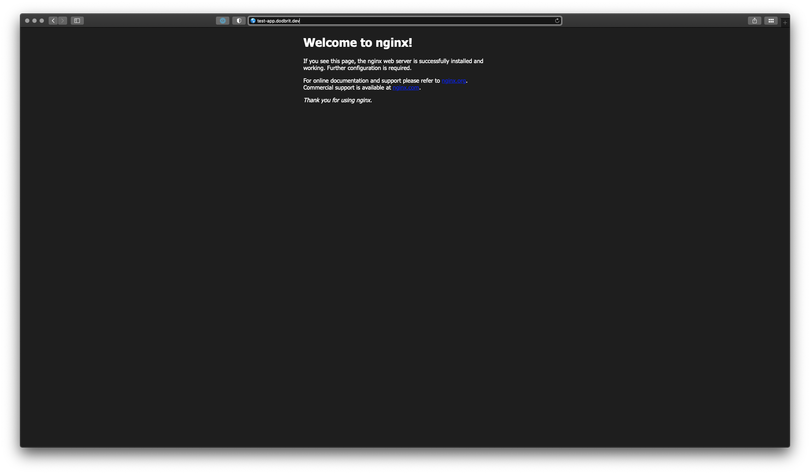

# Deploy a K3S Cluster with Kube-Vip & NGINX Ingress Controller
By the end of this blog post, we will deploy a K3S cluster utilizing `kube-vip` as a load balancer and `nginx` as the cluster ingress controller.

<!--truncate-->

:::info
There is a difference between **nginx-ingress** and **ingress-nginx**. Long story short, one is maintained by NGINX/F5, the other by the Kuberenetes Communinity respectively. For the purposes of this blog, I will be using the Kubernetes Community version, **ingress-nginx**. If you wish to learn more about the differences, feel free to review a helpful [blog post](https://www.nginx.com/blog/guide-to-choosing-ingress-controller-part-4-nginx-ingress-controller-options/) provided by NGINX.
:::

## Requirements
Listed below are the tools, and software, utilized to complete this deployment;

| **Name** | **Description** |
| --- | --- |
| [K3Sup](https://github.com/alexellis/k3sup)| Pronounced "Ketchup", K3Sup is a light-weight utility to get from zero to KUBECONFIG with k3s on any local or remote VM. All you need is ssh access and the k3sup binary to get kubectl access immediately.|
| [K3S](https://k3s.io) | K3s is an official CNCF sandbox project that delivers a lightweight yet powerful certified Kubernetes distribution designed for production workloads across resource-restrained, remote locations or on IoT devices. When used with Rancher, K3s is simple to install, lightweight yet high availability Kubernetes distribution that can be easily managed within the Rancher orchestration platform. |
| [Kube-Vip](https://kube-vip.io) | kube-vip provides Kubernetes clusters with a virtual IP and load balancer for both the control plane (for building a highly-available cluster) and Kubernetes Services of type LoadBalancer without relying on any external hardware or software. |
| [Ingress-Nginx](https://kubernetes.github.io/ingress-nginx/) | NGINX Ingress Controller provided, and maintained, but the Kubernetes community |

## Deployment Steps

### Step 1: Deploy Server Node(s)
For the sake of this blog post, I'm deploying a single server node with one agent. However, the concepts can be expanded to to deploy a fully HA cluster.

1. Ensure you have SSH access to the node
2. Deploy **K3S** on the node using **K3Sup**

``` bash
k3sup install --ip xx.xx.xx.xx --cluster  --k3s-channel v1.23.9+k3s1 \
    --merge --local-path $HOME/.kube/config --context=tools-cluster \
    --k3s-extra-args '--no-deploy traefik --disable servicelb' \
    --user root --ssh-key $HOME/.ssh/id_rsa
```

In the command above,

- `--ip` is the IP address of the node you wish to install K3S on
- `--cluster` is a K3S flag to initialize a Cluster (vs. a single node)
- `--k3s-channel` is the specific version of K3S to install
- `--merge` instructions K3Sup to merge the new KUBECONFIG with your local KUBECONFIG file
- `--local-path` location of your local KUBECONFIG file
- `--context` the name of the cluster to be used within your KUBECONFIG file
- `--k3s-extra-args` additional arguments to be passed to the K3S installation script
- `--user` the user account to be used to connect to the remote node
- `--ssh-key` the location of your local SSH key that will be used to connect to the remote node

3. Deploy additional Server Nodes (Optional)
*placeholder*

4. Validate the cluster installed successfully

``` bash
## LOAD KUBECONFIG FILE (PATH MAYBE DIFFERENT)
export KUBECONFIG=~/.kube/config

## SWITCH TO THE CORRECT CONTEXT
kubectx tools-cluster

## LIST CLUSTER NODES
kubectl get nodes -o wide

NAME          STATUS   ROLES                       AGE   VERSION
node-001      Ready    control-plane,etcd,master   40m   v1.23.9+k3s11
```

### Step 2: Deploy Agent Node(s)
For all other nodes, we will add them to the cluster as Agent nodes.

1. Install K3S on Agent Nodes

``` bash
k3sup join --ip xx.xx.xx.xx --server-ip xx.xx.xx.xx \
    --k3s-channel v1.23.9+k3s1 \
    --user root --ssh-key $HOME/.ssh/id_rsa
```

In the command above,

- `--ip` is the IP address of the node you wish to install K3S on
- `--server-ip` is the IP address of any server node in your cluster
- `--k3s-channel` is the specific version of K3S to install
- `--user` the user account to be used to connect to the remote node
- `--ssh-key` the location of your local SSH key that will be used to connect to the remote node

2. Validate the agents joined the cluster successfully

``` bash
## LIST CLUSTER NODES
kubectl get nodes -o wide

NAME          STATUS   ROLES                       AGE   VERSION
node-001      Ready    control-plane,etcd,master   40m   v1.23.9+k3s11
node-002      Ready    <none>                      66m   v1.23.9+k3s1
```


### Step 3: Deploy Kube-Vip

To deploy `Kube-Vip`, you will need to create the following files and make some updates. 

:::tip
You will need to make the following updates in your `kube-vip-ds.yaml` file;

- line 36 -- provide an IP address within your environment
- line 56 -- update the interface name to the interface of your nodes
:::

:::note
I removed the `affinity` properties (lines 17 thru 26) to deploy kube-vip on all nodes. I've configured my cluster this way to allow `Kube-Vip` to act as an internal load-balancer for my NGINX Ingress Controller.
:::

``` yaml title="kube-vip-rbac.yaml" showLineNumbers
apiVersion: v1
kind: ServiceAccount
metadata:
  name: kube-vip
  namespace: kube-system
---
apiVersion: rbac.authorization.k8s.io/v1
kind: ClusterRole
metadata:
  annotations:
    rbac.authorization.kubernetes.io/autoupdate: "true"
  name: system:kube-vip-role
rules:
  - apiGroups: [""]
    resources: ["services", "services/status", "nodes", "endpoints"]
    verbs: ["list","get","watch", "update"]
  - apiGroups: ["coordination.k8s.io"]
    resources: ["leases"]
    verbs: ["list", "get", "watch", "update", "create"]
---
kind: ClusterRoleBinding
apiVersion: rbac.authorization.k8s.io/v1
metadata:
  name: system:kube-vip-binding
roleRef:
  apiGroup: rbac.authorization.k8s.io
  kind: ClusterRole
  name: system:kube-vip-role
subjects:
- kind: ServiceAccount
  name: kube-vip
```

``` yaml title="kube-vip-ds.yaml" showLineNumbers
apiVersion: apps/v1
kind: DaemonSet
metadata:
  creationTimestamp: null
  name: kube-vip-ds
  namespace: kube-system
spec:
  selector:
    matchLabels:
      name: kube-vip-ds
  template:
    metadata:
      creationTimestamp: null
      labels:
        name: kube-vip-ds
    spec:
      affinity:
        nodeAffinity:
          requiredDuringSchedulingIgnoredDuringExecution:
            nodeSelectorTerms:
            - matchExpressions:
              - key: node-role.kubernetes.io/master
                operator: Exists
            - matchExpressions:
              - key: node-role.kubernetes.io/control-plane
                operator: Exists
      containers:
      - args:
        - manager
        env:
        - name: vip_arp
          value: "true"
        - name: port
          value: "6443"
        - name: vip_interface
          value: ens160
        - name: vip_cidr
          value: "32"
        - name: cp_enable
          value: "true"
        - name: cp_namespace
          value: kube-system
        - name: vip_ddns
          value: "false"
        - name: svc_enable
          value: "true"
        - name: vip_leaderelection
          value: "true"
        - name: vip_leaseduration
          value: "5"
        - name: vip_renewdeadline
          value: "3"
        - name: vip_retryperiod
          value: "1"
        - name: address
          value: x.x.x.x
        image: ghcr.io/kube-vip/kube-vip:v0.4.0
        imagePullPolicy: Always
        name: kube-vip
        resources: {}
        securityContext:
          capabilities:
            add:
            - NET_ADMIN
            - NET_RAW
            - SYS_TIME
      hostNetwork: true
      serviceAccountName: kube-vip
      tolerations:
      - effect: NoSchedule
        operator: Exists
      - effect: NoExecute
        operator: Exists
  updateStrategy: {}
status:
  currentNumberScheduled: 0
  desiredNumberScheduled: 0
  numberMisscheduled: 0
  numberReady: 0
```

Once you have created the above files (with required updates), run the following commands to deploy and verify the kube-vip is working. This will deploy a kube-vip pod on every server node.

``` bash
## DEPLOY RBAC RULES
kubectl apply -f kube-vip-rbac.yaml

## DEPLOY KUBE-VIP DAEMONSET
kubectl apply -f kube-vip-ds.yaml

## VERIFY STATUS (ONCE POD IS RUNNING)
ping {{ IP-ADDRESS-YOU-PROVIDED }}
```

### Step 4: Deploy Ingress Controller
For this deployment, we are going to deploy **ingress-nginx**. There really is nothing to the deployment other then applying a Helm Chart.

1. Deploy ingress-nginx

``` bash
helm upgrade --install ingress-nginx ingress-nginx \
    --repo https://kubernetes.github.io/ingress-nginx \
    --namespace ingress-nginx --create-namespace
```

2. Validate install. You should see two new pods `svclb-ingress-nginx-controller-xxxxx` and `ingress-nginx-controller-xxxxx`.

``` bash
watch kubectl get pods -A

NAMESPACE       NAME                                        READY   STATUS    RESTARTS   AGE
ingress-nginx   ingress-nginx-controller-54d587fbc6-j7sx4   1/1     Running   0          3m31s
kube-system     coredns-d76bd69b-sv6k6                      1/1     Running   0          49m
kube-system     kube-vip-ds-fwpj6                           1/1     Running   0          21m
kube-system     kube-vip-ds-rv8vn                           1/1     Running   0          21m
kube-system     local-path-provisioner-6c79684f77-4hrpz     1/1     Running   0          49m
kube-system     metrics-server-7cd5fcb6b7-4fvrj             1/1     Running   0          49m
```

### Step 5: Deploy test Application & Expose via NGINX Ingress (and Kube-VIP)
The best way to validate the installation, and correct configuration, of the ingress controller is to deploy a test application and ensure we can navigate to it. Create the `test-app.yaml` file and apply it to the kubernetes cluster `kubectl apply -f test-app.yaml`. 

``` yaml title="test-app.yaml" showLineNumbers
---
apiVersion: v1
kind: Namespace
metadata:
    name: test-app
---
apiVersion: apps/v1
kind: Deployment
metadata:
  name: test-nginx-app
  namespace: test-app
spec:
  selector:
    matchLabels:
      name: test-nginx-backend
  template:
    metadata:
      labels:
        name: test-nginx-backend
    spec:
      containers:
        - name: backend
          image: docker.io/nginx:alpine
          imagePullPolicy: Always
          ports:
            - containerPort: 80
---
apiVersion: v1
kind: Service
metadata:
  name: test-nginx-service
  namespace: test-app
spec:
  ports:
    - name: http
      port: 80
      protocol: TCP
      targetPort: 80
  selector:
    name: test-nginx-backend
---
apiVersion: networking.k8s.io/v1
kind: Ingress
metadata:
  name: test-nginx-ingress
  namespace: test-app
spec:
  ingressClassName: nginx
  rules:
  - host: {{ MY-DESIRED-URL }}
    http:
      paths:
        - path: /
          pathType: Prefix
          backend:
            service:
              name: test-nginx-service
              port:
                number: 80
```

Simply put, this manifest is creating a *test-app* namespace, deploying a simple NGINX web server, defining the service to access the deployment, and finally exposing the deployment via the URL provided on line 45. Configure your local DNS, or host file, to point the URL specified to the IP address of that you configured `kube-vip` with and then navigate to the specified URL, and you should be greeted with the default NGINX page.
 


:::caution
During the writing of this post, I switched my labs TLD to `.dev` to follow best practices. Of course, what I thought was meant to be a simple switch landed up presenting me with another challenge (oh the joys of a homelab). The `.dev` TLD is owned by Google, and they have recently added the `.dev.` TLD to the Chrome HSTS which is just a nice way to say, any `.dev` URLS will be automatically redirected to `https:\\`. Originally, this only effected Chrome based browser, but the majority of the other major browsers have since updated their respective HSTS settings to match (I tested this with Safari).
:::

### Step 5b: Expose Test Application via SSL
There are multiple ways to obtain an SSL certificate; you could have access to a private Certificate Authority (CA), you could purchase one from a replicable company, you could generate your own self-signed certificates, or you could obtain them from LetEncrypt. Each method has their own Pros, Cons and Challenges. For the sake of this post, I'm going to utilize LetEncrypt.

> Let's Encrypt is a free, automated, and open certificate authority brought to you by the nonprofit Internet Security Research Group (ISRG).
>
> \- [LetsEncrypt](https://letsencrypt.org/)

To help manage the SSL certificates (Renewals), the community has created an application called `cert-manager` to do the heavy lifting. 


:::tip
I'm using CloudFlare as my DNS provider. `Cert-Manager` supports other DNS providers. Review the [Documentation](https://cert-manager.io/docs/installation/helm/) for your specific provider.
:::

1. Install `Cert-Manager`.

``` bash
## ADD HELM REPO & UPDATE
helm repo add jetstack https://charts.jetstack.io
helm repo update

## INSTALL REQUIRED CRDS FOR CERT-MANAGER
kubectl apply -f https://github.com/cert-manager/cert-manager/releases/download/v1.9.1/cert-manager.crds.yaml

## INSTALL CERT-MANAGER
helm upgrade --install \
  cert-manager jetstack/cert-manager \
  --namespace cert-manager \
  --create-namespace \
  --version v1.9.1

## VERIFY INSTALL
kubectl get pods -n cert-manager

NAME                                       READY   STATUS    RESTARTS   AGE
cert-manager-85f68f95f-kbtbv               1/1     Running   0          25m
cert-manager-cainjector-7d9668978d-qfkcm   1/1     Running   0          25m
cert-manager-webhook-66c8f6c75-28qqv       1/1     Running   0          25m
```

Configure `Cert-Manager` for CloudFlare.

2. Create CloudFlare API Token with the following;

- **Permissions**
  - Zone - DNS - Edit
  - Zone - Zone - Read
- **Zone Resources**
  - Include - All Zones

3. Define Issuer & Create API Token Secret

``` yaml title="cert-manager-clusterissuer-secret.yaml" 
apiVersion: v1
kind: Secret
metadata:
  name: cloudflare-api-token-secret
  namespace: kube-system
type: Opaque
stringData:
  api-token: {{ CLOUDFLARE-API-TOKEN }}
```

``` yaml title="cert-manager-clusterissuer-staging.yaml"
apiVersion: cert-manager.io/v1
kind: ClusterIssuer
metadata:
  name: staging-issuer
spec:
  acme:
    ## EMAIL ADDRESS FOR LETSENCRYPT TO CONTACT YOU
    email: {{ WEBMASTER-EMAIL-ADDRESS }}
    ## STAGING SERVER (FOR TESTING)
    server: https://acme-staging-v02.api.letsencrypt.org/directory
    privateKeySecretRef:
      name: staging-issuer-account-key
    solvers:
    - dns01:
        cloudflare:
          email: {{ CLOUDFLARE-EMAIL-ADDRESS }}
          apiTokenSecretRef:
            name: cloudflare-api-token-secret                  
            key: api-token
```

:::tip
`Issuer` and `ClusterIssuer` are essentially the same resource with one big exception. `ClusterIssuer` are not tied to a specific namespace and can be used by any namespace within the cluster. 
:::

4. Create `Cert-Manager` Kubernetes Resources
   
``` bash
## CREATE API TOKEN SECRET
kubectl apply -f cert-manager-clusterissuer-secret.yaml

## CREATE CLUSTER ISSUER (STAGING)
kubectl apply -f cert-manager-clusterissuer-staging.yaml
```

5. Verify 
   
``` bash
kubectl get clusterissuers.cert-manager.io

NAME             READY   AGE
staging-issuer   True    6s
```

6. Define Testing (Staging) Certificate

``` yaml title="cert-manager-certificate-staging.yaml"
apiVersion: cert-manager.io/v1
kind: Certificate
metadata:
  name: {{ DOMAIN-NAME-WITH-HYPENS }}-staging
  namespace: default
spec:
  secretName: {{ DOMAIN-NAME-WITH-HYPENS }}-tls
  issuerRef:
    name: staging-issuer
    kind: ClusterIssuer
  commonName: {{ DOMAIN-NAME }}
  dnsNames:
  - {{ DOMAIN-NAME }}
  - '*.{{ DOMAIN-NAME }}'
```

7. Request Testing (Staging) Certificate

## Uninstall Steps
In the event you need to uninstall a node (server or agent), Rancher provides the following scripts;

**For Server Uninstall**
```bash
/usr/local/bin/k3s-uninstall.sh
```

**For Agent Uninstall**
``` bash
/usr/local/bin/k3s-agent-uninstall.sh
```