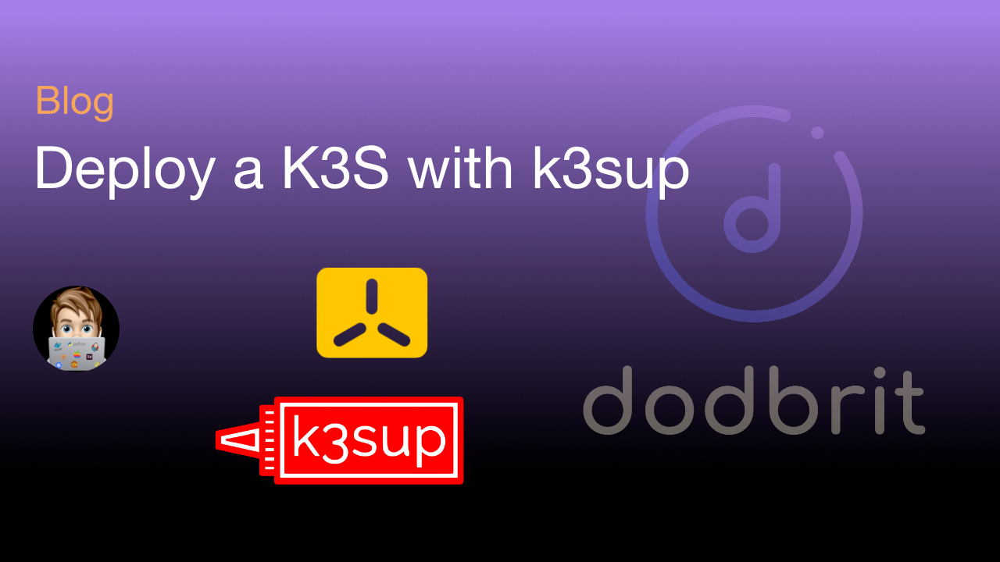
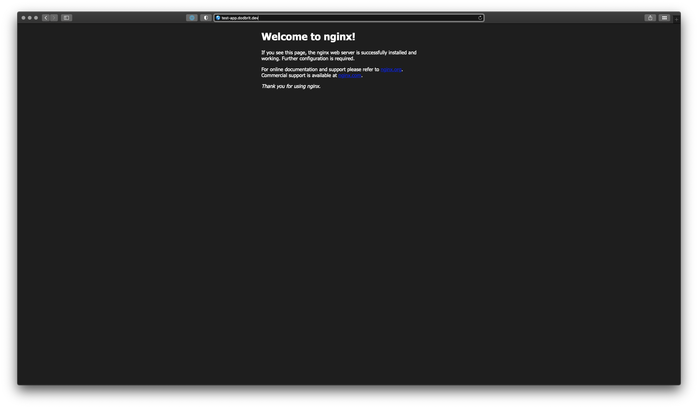

# Deploy a K3S Cluster with k3sup
By the end of this blog post, we will deploy a K3S cluster using the `k3sup` (Ketchup) tool. Utilizing `kube-vip` as a load balancer and `nginx` as the cluster ingress controller.

<!--truncate-->

:::info
There is a difference between **nginx-ingress** and **ingress-nginx**. Long story short, one is maintained by NGINX/F5, the other by the Kuberenetes Communinity respectively. For the purposes of this blog, I will be using the Kubernetes Community version, **ingress-nginx**. If you wish to learn more about the differences, feel free to review a helpful [blog post](https://www.nginx.com/blog/guide-to-choosing-ingress-controller-part-4-nginx-ingress-controller-options/) provided by NGINX.
:::

### Ingress vs. Load-Balancer
*Placeholder*

### Kube-VIP
*Placeholder*

### Architecture
*Placeholder*

<div style={{textAlign: 'center'}}>


</div>

### Requirements
Listed below are the tools, and software, utilized to complete this deployment;

| **Name** | **Description** |
| --- | --- |
| [K3Sup](https://github.com/alexellis/k3sup)| Pronounced "Ketchup", K3Sup is a light-weight utility to get from zero to KUBECONFIG with k3s on any local or remote VM. All you need is ssh access and the k3sup binary to get kubectl access immediately.|
| [K3S](https://k3s.io) | K3s is an official CNCF sandbox project that delivers a lightweight yet powerful certified Kubernetes distribution designed for production workloads across resource-restrained, remote locations or on IoT devices. When used with Rancher, K3s is simple to install, lightweight yet high availability Kubernetes distribution that can be easily managed within the Rancher orchestration platform. |
| [Kube-Vip](https://kube-vip.io) | kube-vip provides Kubernetes clusters with a virtual IP and load balancer for both the control plane (for building a highly-available cluster) and Kubernetes Services of type LoadBalancer without relying on any external hardware or software. |
| [Ingress-Nginx](https://kubernetes.github.io/ingress-nginx/) | NGINX Ingress Controller provided, and maintained, but the Kubernetes community |

## Deployment Steps

### Step 1: Deploy Server Node(s)
For the sake of this blog post, I'm deploying a single server node with one agent. However, the concepts can be expanded to to deploy a fully HA cluster.

1. Ensure you have SSH access to the node
2. Deploy **K3S** on the node using **K3Sup**

``` bash
k3sup install --ip xx.xx.xx.xx --cluster  --k3s-channel v1.23.9+k3s1 \
    --merge --local-path $HOME/.kube/config --context=tools-cluster \
    --k3s-extra-args '--no-deploy traefik --disable servicelb' \
    --user root --ssh-key $HOME/.ssh/id_rsa
```

In the command above,

| **Attribute** | **Description** |
| --- | --- |
| `--ip` | is the IP address of the node you wish to install K3S on |
| `--cluster` | is a K3S flag to initialize a Cluster (vs. a single node) |
| `--k3s-channel` | is the specific version of K3S to install |
| `--merge` | instructions K3Sup to merge the new KUBECONFIG with your local KUBECONFIG file |
| `--local-path` | location of your local KUBECONFIG file |
| `--context` | the name of the cluster to be used within your KUBECONFIG file |
| `--k3s-extra-args` | additional arguments to be passed to the K3S installation script |
| `--user` | the user account to be used to connect to the remote node |
| `--ssh-key` | the location of your local SSH key that will be used to connect to the remote node |

3. Deploy additional Server Nodes (Optional)
*placeholder*

4. Validate the cluster installed successfully

``` bash
## LOAD KUBECONFIG FILE (PATH MAYBE DIFFERENT)
export KUBECONFIG=~/.kube/config

## SWITCH TO THE CORRECT CONTEXT
kubectx tools-cluster

## LIST CLUSTER NODES
kubectl get nodes

NAME          STATUS   ROLES                       AGE   VERSION
node-001      Ready    control-plane,etcd,master   40m   v1.23.9+k3s11
```

### Step 2: Deploy Agent Node(s)
For all other nodes, we will add them to the cluster as Agent nodes.

1. Install K3S on Agent Nodes

``` bash
k3sup join --ip xx.xx.xx.xx --server-ip xx.xx.xx.xx \
    --k3s-channel v1.23.9+k3s1 \
    --user root --ssh-key $HOME/.ssh/id_rsa
```

In the command above,

| **Attribute** | **Description** |
| --- | --- |
| `--ip` | is the IP address of the node you wish to install K3S on |
| `--server-ip` | is the IP address of any server node in your cluster |
| `--k3s-channel` | is the specific version of K3S to install |
| `--user` | the user account to be used to connect to the remote node |
| `--ssh-key` | the location of your local SSH key that will be used to connect to the remote node |

2. Validate the agents joined the cluster successfully

``` bash
## LIST CLUSTER NODES
kubectl get nodes

NAME          STATUS   ROLES                       AGE   VERSION
node-001      Ready    control-plane,etcd,master   40m   v1.23.9+k3s11
node-002      Ready    control-plane,etcd,master   38m   v1.23.9+k3s11
node-003      Ready    control-plane,etcd,master   35m   v1.23.9+k3s11
node-004      Ready    <none>                      26m   v1.23.9+k3s1
node-005      Ready    <none>                      21m   v1.23.9+k3s1
node-006      Ready    <none>                      18m   v1.23.9+k3s1
```

### Step 3: Deploy Kube-Vip

To deploy `Kube-Vip`, you will need to create the following files and make some updates. 

1. Generate `kube-vip-rbac.yaml` and `kube-vip-ds.yaml` files with the appropriate changes.
:::tip
You will need to make the following updates in your `kube-vip-ds.yaml` file;

- line 36 -- provide an IP address within your environment
- line 56 -- update the interface name to the interface of your nodes
:::

``` yaml title="kube-vip-rbac.yaml" showLineNumbers
apiVersion: v1
kind: ServiceAccount
metadata:
  name: kube-vip
  namespace: kube-system
---
apiVersion: rbac.authorization.k8s.io/v1
kind: ClusterRole
metadata:
  annotations:
    rbac.authorization.kubernetes.io/autoupdate: "true"
  name: system:kube-vip-role
rules:
  - apiGroups: [""]
    resources: ["services", "services/status", "nodes", "endpoints"]
    verbs: ["list","get","watch", "update"]
  - apiGroups: ["coordination.k8s.io"]
    resources: ["leases"]
    verbs: ["list", "get", "watch", "update", "create"]
---
kind: ClusterRoleBinding
apiVersion: rbac.authorization.k8s.io/v1
metadata:
  name: system:kube-vip-binding
roleRef:
  apiGroup: rbac.authorization.k8s.io
  kind: ClusterRole
  name: system:kube-vip-role
subjects:
- kind: ServiceAccount
  name: kube-vip
```

``` yaml title="kube-vip-ds.yaml" showLineNumbers
apiVersion: apps/v1
kind: DaemonSet
metadata:
  creationTimestamp: null
  name: kube-vip-ds
  namespace: kube-system
spec:
  selector:
    matchLabels:
      name: kube-vip-ds
  template:
    metadata:
      creationTimestamp: null
      labels:
        name: kube-vip-ds
    spec:
      affinity:
        nodeAffinity:
          requiredDuringSchedulingIgnoredDuringExecution:
            nodeSelectorTerms:
            - matchExpressions:
              - key: node-role.kubernetes.io/master
                operator: Exists
            - matchExpressions:
              - key: node-role.kubernetes.io/control-plane
                operator: Exists
      containers:
      - args:
        - manager
        env:
        - name: vip_arp
          value: "true"
        - name: port
          value: "6443"
        - name: vip_interface
          value: ens160
        - name: vip_cidr
          value: "32"
        - name: cp_enable
          value: "true"
        - name: cp_namespace
          value: kube-system
        - name: vip_ddns
          value: "false"
        - name: svc_enable
          value: "true"
        - name: vip_leaderelection
          value: "true"
        - name: vip_leaseduration
          value: "5"
        - name: vip_renewdeadline
          value: "3"
        - name: vip_retryperiod
          value: "1"
        - name: address
          value: x.x.x.x
        image: ghcr.io/kube-vip/kube-vip:v0.4.0
        imagePullPolicy: Always
        name: kube-vip
        resources: {}
        securityContext:
          capabilities:
            add:
            - NET_ADMIN
            - NET_RAW
            - SYS_TIME
      hostNetwork: true
      serviceAccountName: kube-vip
      tolerations:
      - effect: NoSchedule
        operator: Exists
      - effect: NoExecute
        operator: Exists
  updateStrategy: {}
status:
  currentNumberScheduled: 0
  desiredNumberScheduled: 0
  numberMisscheduled: 0
  numberReady: 0
```

2. Deploy `kube-vip` with the following commands. This will deploy a kube-vip pod on every **server** node.

``` bash
## DEPLOY RBAC RULES
kubectl apply -f kube-vip-rbac.yaml

## DEPLOY KUBE-VIP DAEMONSET
kubectl apply -f kube-vip-ds.yaml

```

3. Verify `kube-vip` deploy successfully.

``` bash
## VERIFY STATUS (ONCE POD IS RUNNING)
ping {{ IP-ADDRESS-YOU-PROVIDED }}

PING xx.xx.xx.xx (xx.xx.xx.xx): 56 data bytes
64 bytes from xx.xx.xx.xx: icmp_seq=1 ttl=63 time=2.199 ms
64 bytes from xx.xx.xx.xx: icmp_seq=2 ttl=63 time=2.074 ms
64 bytes from xx.xx.xx.xx: icmp_seq=3 ttl=63 time=2.424 ms
64 bytes from xx.xx.xx.xx: icmp_seq=2 ttl=63 time=2.074 ms
```

4. Deploy `kube-vip` [Cloud Controller](https://kube-vip.io/docs/usage/cloud-provider/)

``` bash
kubectl apply -f https://raw.githubusercontent.com/kube-vip/kube-vip-cloud-provider/main/manifest/kube-vip-cloud-controller.yaml
```

5. Configure the Cloud Controller with an IP address.

:::note
Because we are exposing our services via the NGINX Ingress Controller, only a single IP address needs to be provided in the following `ConfigMap`.

i.e. `range-global=192.168.0.220-192.168.0.220` 

or `cidr-global=192.168.0.220/32`
:::

``` bash
## CONFIGURE KUBE-VIP CLOUD CONTROLLER

## VIA CIDR
kubectl create configmap -n kube-system kubevip --from-literal cidr-global=xx.xx.xx.xx/24

## VIA RANGE
kubectl create configmap -n kube-system kubevip --from-literal range-global=xx.xx.xx.xx-xx.xx.xx.xx
```

6. Verify `kube-vip` Cloud Controller is exposed on the correct address. The `External-IP` of `ingress-nginx-controller` should match the IP passed in the `ConfigMap`.

``` bash
kubectl get svc -n ingress-nginx

NAME                                 TYPE           CLUSTER-IP      EXTERNAL-IP     PORT(S)                      AGE
ingress-nginx-controller             LoadBalancer   10.43.255.198   192.168.0.220   80:31419/TCP,443:32623/TCP   14m
ingress-nginx-controller-admission   ClusterIP      10.43.231.66    <none>          443/TCP                      14m
```

### Step 4: Deploy Ingress Controller
For this deployment, we are going to deploy **ingress-nginx**. There really is nothing to the deployment other then applying a Helm Chart.

1. Deploy ingress-nginx

``` bash
helm upgrade --install ingress-nginx ingress-nginx \
    --repo https://kubernetes.github.io/ingress-nginx \
    --namespace ingress-nginx --create-namespace
```

2. Validate Install. You should see two new pods `svclb-ingress-nginx-controller-xxxxx` and `ingress-nginx-controller-xxxxx`. Once the pods are ready, you should be able to navigate to the IP Address specified in the previous step and be greeted with an NGINX 404 Not Found page (at this stage 404 is good). 

## Summary + Test Application
At this point, you should have a stable cluster (potentially HA) that is ready to host and expose applications. The best way to validate the installation, and correct configuration, of the ingress controller is to deploy a test application and ensure we can navigate to it. Create the `test-app.yaml` file and apply it to the kubernetes cluster `kubectl apply -f test-app.yaml`. 

``` yaml title="test-app.yaml" showLineNumbers
---
apiVersion: v1
kind: Namespace
metadata:
    name: test-app
---
apiVersion: apps/v1
kind: Deployment
metadata:
  name: test-nginx-app
  namespace: test-app
spec:
  selector:
    matchLabels:
      name: test-nginx-backend
  template:
    metadata:
      labels:
        name: test-nginx-backend
    spec:
      containers:
        - name: backend
          image: docker.io/nginx:alpine
          imagePullPolicy: Always
          ports:
            - containerPort: 80
---
apiVersion: v1
kind: Service
metadata:
  name: test-nginx-service
  namespace: test-app
spec:
  ports:
    - name: http
      port: 80
      protocol: TCP
      targetPort: 80
  selector:
    name: test-nginx-backend
---
apiVersion: networking.k8s.io/v1
kind: Ingress
metadata:
  name: test-nginx-ingress
  namespace: test-app
spec:
  ingressClassName: nginx
  rules:
  - host: {{ MY-DESIRED-URL }}
    http:
      paths:
        - path: /
          pathType: Prefix
          backend:
            service:
              name: test-nginx-service
              port:
                number: 80
```

Simply put, this manifest is creating a *test-app* namespace, deploying a simple NGINX web server, defining the service to access the deployment, and finally exposing the deployment via the URL provided on line 45. Configure your local DNS, or host file, to point the URL specified to the IP address of that you configured `kube-vip` with and then navigate to the specified URL, and you should be greeted with the default NGINX page.
 


:::caution
During the writing of this post, I switched my labs TLD to `.dev` to follow best practices. Of course, what I thought was meant to be a simple switch landed up presenting me with another challenge (oh the joys of a homelab). The `.dev` TLD is owned by Google, and they have recently added the `.dev.` TLD to the Chrome HSTS which is just a nice way to say, any `.dev` URLS will be automatically redirected to `https:\\`. Originally, this only effected Chrome based browser, but the majority of the other major browsers have since updated their respective HSTS settings to match (I tested this with Safari). When using a `.dev.` domain, you will be greeted with invalid certificate error as NGINX Ingress Controller defaults to a self-generated SSL certificate in the event a certificate isn't provided.
:::

### Extras

#### KUBECONFIG
If you happen to overwrite (or delete) your KUBECONFIG file, you can obtain a new copy by running the install command again with the addition of an extra flag `--skip-install`. 

```  bash
k3sup install --skip-install --host xx.xx.xx.xx \
  --merge --local-path $HOME/.kube/config --context=tools-cluster \
  --user root --ssh-key $HOME/.ssh/id_rsa
```

#### Uninstall Steps
In the event you need to uninstall a node (server or agent), Rancher provides the following scripts;

**For Server Uninstall**
```bash
/usr/local/bin/k3s-uninstall.sh
```

**For Agent Uninstall**
``` bash
/usr/local/bin/k3s-agent-uninstall.sh
```