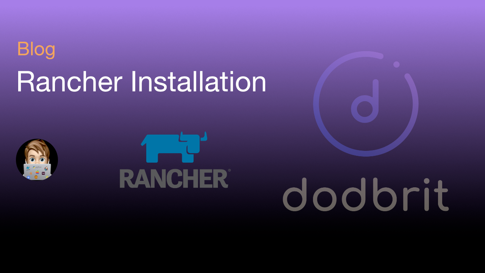

# Install Rancher in a K3S Cluster
Since it has been awhile since I've posted an article, I'm going to start with a simple one that I always seem to need to reference. After reading this short post, you should be able to deploy a Rancher installation in a K3S cluster that is exposed via NGINX Ingress and has a valid SSL certificate provided by Lets Encrypt.

<!--truncate-->

## Installation
The installation of Rancher is fairly straightforward as it is a helm chart. For more information about the installation, review the [Rancher Documentation](https://rancher.com/docs/rancher/v2.6/en/installation/)

:::note
In this blog post I'm utilizing my lab environment domain (`dodbrit.dev`). If you are following along, replace `dodbrit.dev` with a domain suitable for your environment.
:::

1. Update DNS Server to point `https://rancher.dodbrit.dev` to the IP Address of the Ingress Controller (`10.0.19.10`).
   
2. Install Rancher in our current environment

a) Install Rancher via CLI

``` bash
helm upgrade --install rancher rancher-latest/rancher \
    --namespace cattle-system --create-namespace \
    --set hostname=rancher.dodbrit.dev --set replicas=1  \
    --set tls=ingress --set ingress.ingressClassName=nginx \
    --set ingress.tls.source=secret \
    --set ingress.extraAnnotations."cert-manager\.io/cluster-issuer=le-issuer"
```

b) Install via Helm Values File

``` yaml title="values.yaml" showLineNumbers
hostname: rancher.dodbrit.dev
replicas: 1
tls: ingress
ingress:
  ingressClassName: nginx
  tls:
    source: secret
  extraAnnotations:
    cert-manager.io/cluster-issuer: le-issuer
```

``` bash
helm upgrade --install rancher rancher-latest/rancher \
    --namespace cattle-system --create-namespace \
    -f values.yaml
```

3. Validate Successfully Installation

``` bash
kubectl get pods -n cattle-system -o wide

NAME                              READY   STATUS     RESTARTS   AGE     IP           NODE               NOMINATED NODE   READINESS GATES
rancher-869c99776d-cv9fk          1/1     Running    0          7m20s   10.42.0.78   dell.dodbrit.dev   <none>           <none>
rancher-webhook-f8785574f-fvbr2   1/1     Running    0          5m23s   10.42.0.83   dell.dodbrit.dev   <none>           <none>
```

1. Obtain the Administrator Password
   
``` bash
kubectl get secret --namespace cattle-system bootstrap-secret -o go-template='{{.data.bootstrapPassword|base64decode}}{{ "\n" }}'
```

5. Navigate to `https://rancher.dodbrit.dev` and validate that Rancher loads correctly.


### In case you were wondering
The table below depicts the values used during installation and why they were needed;

| Value | Description |
| --- | --- |
| `hostname` | The URL of Rancher. Used in the Ingress |
| `replicas` | The number of WebApp Pod to deploy (for HA) |
| `ingress.ingressClassName` | Ensures the correct Cluster Ingress is used |
| `ingress.tls.source` | Configures Rancher to expect the TLS certificate to be in a secret (default: tls-rancher-ingress) |
| `ingress.extraAnnotations` | This annotation Prompts CertManager to obtain an SSL Certificate from LetsEncrypt |

## Uninstall
To uninstall Rancher, perform the following command;

1. Uninstall Rancher
``` bash
helm uninstall -n cattle-system rancher
```