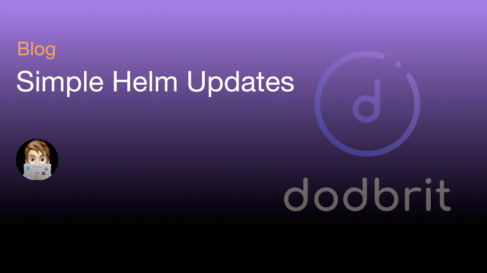

# Simple Helm Chart Updates

## Problem
> *"Helm helps you manage Kubernetes applications — Helm Charts help you define, install, and upgrade even the most complex Kubernetes application. Charts are easy to create, version, share, and publish — so start using Helm and stop the copy-and-paste."* -- [Helm](https://helm.sh)

Helm Charts are a fantastic tool to utilize if you are distributing your complex applications to a wide audience. However, it starts to become a chore to manage as the number of Applications(Charts) and Clusters increase. Without using a Continuous Delivery (CD) tool, such as [ArgoCD](https://argoproj.github.io/cd/), you are left to manage the Charts manually. 

Well that was until I stumbled across this Helm Plugin ...

<!--truncate-->

## Solution
`Helm Whatup` is a Helm plugin to help users determine if there's an update available for their installed charts. It works by reading your locally cached index files from the chart repositories (via helm repo update) and checking the version against the latest deployed version of your charts in the Kubernetes cluster.

> **Note**: The original author of [Helm Whatup](https://github.com/bacongobbler/helm-whatup) has since stopped development. Thanks to the power of the community, [fabmation-gmbh](https://github.com/fabmation-gmbh) has forked the project and continued development.

### Installation
Perform the following steps to install `Helm Whatup`

1. Set the `HELM_HOME` Environment Variable to the Helm Directory (MacOS)
``` bash
export HELM_HOME=/Users/{{username}}/Library/helm
```

2. Install the Helm Plugin
```bash
helm plugin install https://github.com/fabmation-gmbh/helm-whatup
```

### Usage
To use this plugin, simply update the local chart repositories (ensures current versions are found) and perform the scan. 

1. Update Chart Repositories
``` bash
helm repo update
```

2. Check for updatable Charts ...

**In Current Namespace**
``` bash
helm whatup
```

**In All Namespaces**
``` bash
helm whatup -A
```

### Additional Help

``` bash
This Command lists all releases which are outdated.

By default, the output is printed in a Table but you can change this behavior
with the '--output' Flag.


You can enable all BETA features by executing:
	export HELM_WHATUP_BETA_FEATURES=true

Usage:
  whatup [flags]

Aliases:
  whatup, od

Flags:
  -a, --all                   show all releases, not just the ones marked deployed or failed
  -A, --all-namespaces        list releases across all namespaces
      --color                 [BETA] colorize/highlight the repositories from where the chart has been installed
  -d, --date                  sort by release date
      --deployed              show deployed releases. If no other is specified, this will be automatically enabled
      --devel                 use development versions (alpha, beta, and release candidate releases), too. Equivalent to version '>0.0.0-0'.
      --failed                show failed releases
  -h, --help                  help for whatup
      --ignore-deprecation    ignore/skip charts which are marked as "DEPRECATED" (default true)
      --ignore-repo           ignore error if no repo for a chart is found (default true)
  -m, --max int               maximum number of releases to fetch (default 256)
      --offset int            next release name in the list, used to offset from start value
      --only-source-updates   only show updates of a chart repository where the Chart-Version and App-Version do match. (default true)
  -o, --output format         prints the output in the specified format. Allowed values: table, json, yaml (default table)
      --pending               show pending releases
  -r, --reverse               reverse the sort order
  -q, --short                 output short (quiet) listing format
      --superseded            show superseded releases
      --uninstalled           show uninstalled releases
      --uninstalling          show releases that are currently being uninstalled
      --version               show version information
```