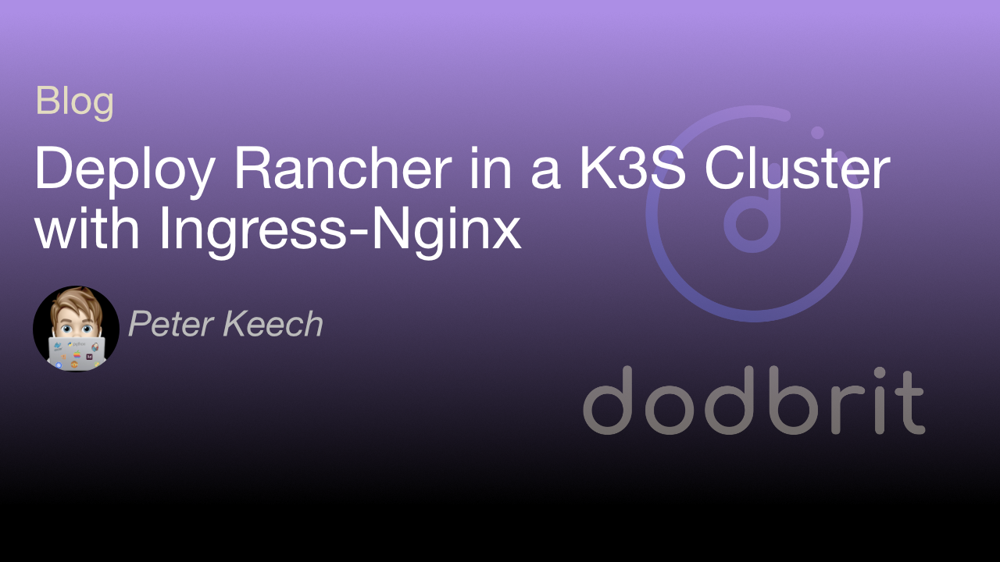
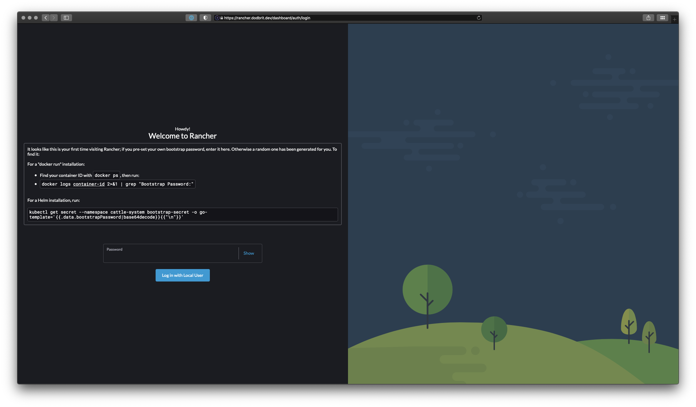

# Deploy Rancher in a K3S Cluster with Ingress-Nginx
*Placeholder*

<!--truncate-->

:::caution
While writing this post, I had issues with Rancher being exposed (404 Error). After doing a little digging I noticed that Rancher's Ingress was not configured to use our Ingress-Nginx nor was our Ingress configured to be the cluster default. You really shouldn't need to modify anything unless its via the Helm Chart, but editing Rancher's ingress to include `spec.ingressClassName: nginx` exposed the App. 

**This configuration will get overwritten the next time Rancher is upgraded (Helm Upgrade)**. 

I'm continuing to research this issue as the first signs appeared to be that this is an on going issue with Rancher. However, this workaround does the trick for the time being.

`kubectl get ingressClass` and `kubectl get ingress -A` are your friends when troubleshooting.
:::

## What is an Ingress Controller?
*Placeholder*

## Important Information to know
There is a difference between **nginx-ingress** and **ingress-nginx**. Long story short, one is maintained by NGINX/F5, the other by the Kuberenetes Communinity respectively. For the purposes of this blog, I will be using the Kubernetes Community version, **ingress-nginx**. If you wish to learn more about the differences, feel free to review a helpful [blog post](https://www.nginx.com/blog/guide-to-choosing-ingress-controller-part-4-nginx-ingress-controller-options/) provided by NGINX.


## Tools Used
Listed below are the tools, and software, utilized to complete this deployment;

| **Name** | **Description** |
| --- | --- |
| [K3Sup](https://github.com/alexellis/k3sup)| Pronounced "Ketchup", K3Sup is a light-weight utility to get from zero to KUBECONFIG with k3s on any local or remote VM. All you need is ssh access and the k3sup binary to get kubectl access immediately.|
| [K3S](#) | K3s is an official CNCF sandbox project that delivers a lightweight yet powerful certified Kubernetes distribution designed for production workloads across resource-restrained, remote locations or on IoT devices. When used with Rancher, K3s is simple to install, lightweight yet high availability Kubernetes distribution that can be easily managed within the Rancher orchestration platform. |
| [Rancher](https://rancher.com/) | One Enterprise Platform for Managed Kubernetes Everywhere |
| [Ingress-Nginx](https://kubernetes.github.io/ingress-nginx/) | NGINX Ingress Controller provided, and maintained, but the Kubernetes community |


## Deployment

### Step 1: Deploy the Cluster
For the sake of this blog post, I'm deploying a single node cluster. However, the concepts can be expanded to to deploy a fully HA cluster.

1. Ensure you have SSH access to the node
2. Deploy **K3S** on the node using **K3Sup**

``` bash
k3sup install --host blog.cl.dodbrit.dev --k3s-channel v1.23.9+k3s1 --merge --local-path $HOME/.kube/config --context=prod-cluster --k3s-extra-args '--no-deploy traefik' --user root --ssh-key $HOME/.ssh/id_rsa
```

| **Argument** | **Description** |
| --- | --- | 
| `--host` | the hostname of the node. This can be replaced with `--ip` if you wish to provide the IP Address instead |
| `--k3s-channel` | the version of K3S to install. By default its configured to install *latest*. For the blog, we are specifying a specific version to ensure compatibility |
| `--merge` | Merge the generated `k3s.yaml` file with your local KUBECONFIG |
| `--local-path` | Specify the path to your local KUBECONFIG file |
| `--context` | The context (aka name) of the cluster used in your KUBECONFIG |
| `--k3s-extra-args 'no-deploy traefik'` | Disable the default installation of Traefik (we are using NGINX instead) |
| `--user` | The user to connect to the node with |
| `--ssh-key` | The location of your ssh key to connect to the node with | 

3. Validate the cluster installed successfully

``` bash
kubectl get nodes

NAME                  STATUS   ROLES                  AGE     VERSION
blog.cl.dodbrit.dev   Ready    control-plane,master   6m55s   v1.23.9+k3s1
```

### Step 2: Deploy Ingress Controller
For this deployment, we are going to deploy **ingress-nginx**. There really is nothing to the deployment other then applying a Helm Chart.

1. Deploy ingress-nginx

``` bash
helm upgrade --install ingress-nginx ingress-nginx \
    --repo https://kubernetes.github.io/ingress-nginx \
    --namespace ingress-nginx --create-namespace
```

2. Validate install. You should see two new pods `svclb-ingress-nginx-controller-` and `ingress-nginx-controller-`.

``` bash
watch kubectl get pods -A

NAMESPACE       NAME                                            READY   STATUS    RESTARTS   AGE
kube-system     local-path-provisioner-6c79684f77-5xbbp         1/1     Running   0          14m
kube-system     coredns-d76bd69b-lqd5k                          1/1     Running   0          14m
kube-system     metrics-server-7cd5fcb6b7-vswdb                 1/1     Running   0          14m
kube-system     svclb-ingress-nginx-controller-0976ac0e-srrrx   2/2     Running   0          116s
ingress-nginx   ingress-nginx-controller-54d587fbc6-fhdxw       1/1     Running   0          116s
```

### Step 3: Test Application Exposure
The best way to validate the installation, and correct configuration, of the ingress controller is to deploy a test application and ensure we can navigate to it. Create the `test-app.yaml` file and apply it to the kubernetes cluster `kubectl apply -f test-app.yaml`. 

``` yaml title="test-app.yaml" showLineNumbers
---
apiVersion: v1
kind: Namespace
metadata:
    name: test-app
---
apiVersion: apps/v1
kind: Deployment
metadata:
  name: test-nginx-app
  namespace: test-app
spec:
  selector:
    matchLabels:
      name: test-nginx-backend
  template:
    metadata:
      labels:
        name: test-nginx-backend
    spec:
      containers:
        - name: backend
          image: docker.io/nginx:alpine
          imagePullPolicy: Always
          ports:
            - containerPort: 80
---
apiVersion: v1
kind: Service
metadata:
  name: test-nginx-service
  namespace: test-app
spec:
  ports:
    - name: http
      port: 80
      protocol: TCP
      targetPort: 80
  selector:
    name: test-nginx-backend
---
apiVersion: networking.k8s.io/v1
kind: Ingress
metadata:
  name: test-nginx-ingress
  namespace: test-app
spec:
  ingressClassName: nginx
  rules:
  - host: {{ MY-DESIRED-URL }}
    http:
      paths:
        - path: /
          pathType: Prefix
          backend:
            service:
              name: test-nginx-service
              port:
                number: 80
```

Simply put, this manifest is creating a *test-app* namespace, deploying a simple NGINX web server, defining the service to access the deployment, and finally exposing the deployment via the URL provided on line 45. By navigating to the specified URL, you should be greeted with the default NGINX page.
 


:::tip
Configure your local DNS, or host file, to point the URL specified to the IP address of the node. In the event of HA deployment, the DNS records would point to all of the Agent (worker) nodes, or VIP for the Agent nodes.
:::

### Step 4: Deploy Rancher
After more research than I care to admit (NGINX ingress controller got me), to deploy rancher we utilize the official Helm Chart.

``` bash
helm upgrade --install rancher rancher-latest/rancher --namespace cattle-system --create-namespace --set hostname=rancher.dodbrit.dev --set tls=external
```

:::tip
Not sure when I started doing this, or why, but I prefer to use the command `helm upgrade --install` over `helm install` when deploying helm charts. Both commands achieve the same outcome, however the first command can be re-ran in the invent of an upgrade or reconfiguration.
:::

| **Argument** | **Description** |
| --- | --- | 
| `upgrade` | Upgrade the Helm deployment |
| `--install` | Install the Helm deployment (if not already installed) |
| `--namespace` | What namespace to install Rancher to |
| `--create-namespace` | Create the namespace (if it doesn't exist) |
| `--set hostname=` | The URL to expose Rancher with |
| `--set tls=` | Allow the Ingress Controller to perform SSL Termination |

In a Enterprise scenario, by configuring the deployment to utilize **SSL Termination**, it allows the developers to worry about deploying their application, while the platform operators can track/maintain SSL certificates. The less hands in the SSL cookie jar, the less likely a certificate can accidentally get compromised.

To validate a successful deployment, run the following command and ensure all 3 pods are deployed successfully. Rancher deploys 3 instances by default, this can be changed easily via Helm Chart values.

``` bash
kubectl -n cattle-system get pods

NAMESPACE       NAME                                            READY   STATUS    RESTARTS      AGE
cattle-system   rancher-74c5484c5-znqch                         1/1     Running   0             8m8s
cattle-system   rancher-74c5484c5-m892x                         1/1     Running   0             8m8s
cattle-system   rancher-74c5484c5-dm469                         1/1     Running   0             8m8s
cattle-system   rancher-webhook-5b65595df9-64z84                1/1     Running   0             68s
```

Navigating to the specified URL should result in being greeted with the Rancher setup page.



Running the command noted on the login page, I was able to reset the password and login to my Rancher instance.

### Step 5: Securing Rancher with SSL Certificates
As you may have already noticed, Rancher has been redirected to HTTPS and is utilizing the default self-signed SSL certificates that are generated when you install NGINX.


## Summary
*Placeholder*


## Reference Files
The following examples are outlines that need to be modified prior to deployment.

### SSL Certificate
``` yaml title="app-ssl.yaml"
apiVersion: v1
  kind: Secret
  metadata:
    name: example-tls
    namespace: foo
  data:
    tls.crt: <base64 encoded cert>
    tls.key: <base64 encoded key>
  type: kubernetes.io/tls
```

### Ingress Rule
``` yaml title="app-ingress.yaml"
apiVersion: networking.k8s.io/v1
kind: Ingress
metadata:
  name: ingress-myservice
  namespace: foo
spec:
  rules:
  - host: www.example.com
    http:
      paths:
      - path: /
        pathType: Prefix
        backend:
          service:
            name: myService
            port:
              number: 80
  ingressClassName: nginx
# This section is only required if TLS is to be enabled for the Ingress
tls:
    - hosts:
    - www.example.com
    secretName: example-tls
```
